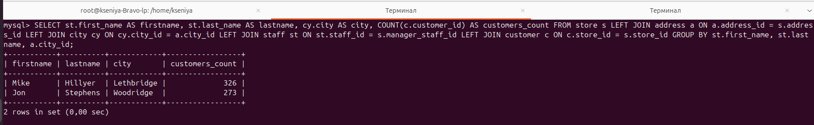
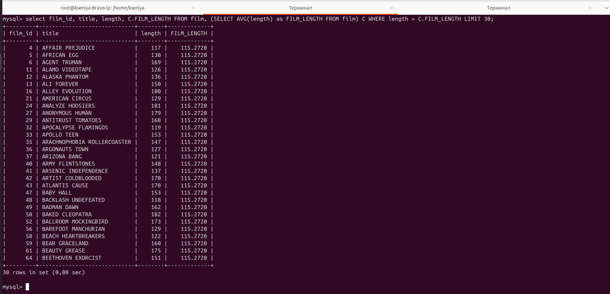
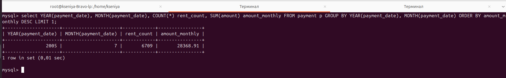
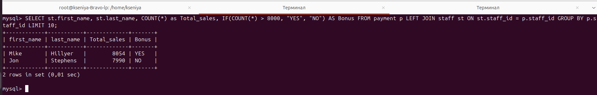
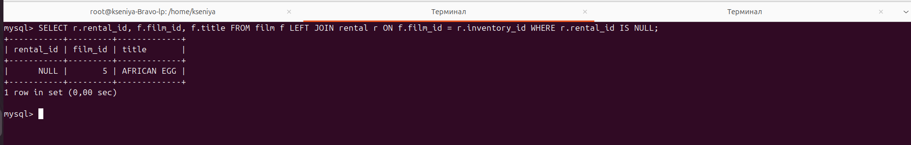

# Домашнее задание к занятию "SQL. Часть 2" - Политико Ксения

---

Задание можно выполнить как в любом IDE, так и в командной строке.

### Задание 1

Одним запросом получите информацию о магазине, в котором обслуживается более 300 покупателей, и выведите в результат следующую информацию: 
- фамилия и имя сотрудника из этого магазина;
- город нахождения магазина;
- количество пользователей, закреплённых в этом магазине.

Запрос для выполнения:

**SELECT st.first_name AS firstname, st.last_name AS lastname, cy.city AS city, COUNT(c.customer_id) AS customers_count 
          FROM store s 
          LEFT JOIN address a ON a.address_id = s.address_id 
          LEFT JOIN city cy ON cy.city_id = a.city_id 
          LEFT JOIN staff st ON st.staff_id = s.manager_staff_id 
          LEFT JOIN customer c ON c.store_id = s.store_id 
          GROUP BY st.first_name, st.last_name, a.city_id;**

### Задание 2

Получите количество фильмов, продолжительность которых больше средней продолжительности всех фильмов.

**SELECT film_id, title, length, C.FILM_LENGTH 
          FROM film, 
               (SELECT AVG(length) AS FILM_LENGTH FROM film) C 
          WHERE length > C.FILM_LENGTH LIMIT 30;**

### Задание 3

Получите информацию, за какой месяц была получена наибольшая сумма платежей, и добавьте информацию по количеству аренд за этот месяц.

**SELECT YEAR(payment_date), MONTH(payment_date), COUNT(*) rent_count, SUM(amount) amount_monthly 
           FROM payment p 
           GROUP BY YEAR(payment_date), MONTH(payment_date) 
           ORDER BY amount_monthly DESC 
           LIMIT 1;**

## Дополнительные задания (со звёздочкой*)
Эти задания дополнительные, то есть не обязательные к выполнению, и никак не повлияют на получение вами зачёта по этому домашнему заданию. Вы можете их выполнить, если хотите глубже шире разобраться в материале.

### Задание 4*

Посчитайте количество продаж, выполненных каждым продавцом. Добавьте вычисляемую колонку «Премия». Если количество продаж превышает 8000, то значение в колонке будет «Да», иначе должно быть значение «Нет».

**SELECT st.first_name, st.last_name, COUNT(*) as Total_sales, IF(COUNT(*) > 8000, "YES", "NO") AS Bonus FROM payment p LEFT JOIN staff st ON st.staff_id = p.staff_id GROUP BY p.staff_id LIMIT 10;**

### Задание 5*

Найдите фильмы, которые ни разу не брали в аренду.

**SELECT r.rental_id, f.film_id, f.title FROM film f LEFT JOIN rental r ON f.film_id = r.inventory_id WHERE r.rental_id IS NULL;**

